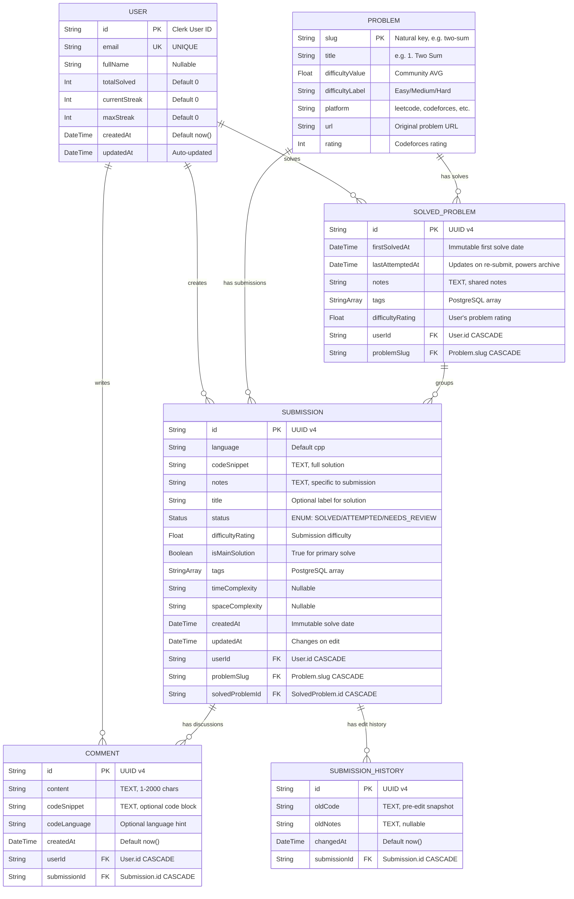

# DSApline V2.0 — Database Documentation & ER Diagram

## 1. Entity-Relationship Diagram (Mermaid)

The following Mermaid code generates the complete ER diagram for the current database schema. Copy this directly into any Mermaid renderer (GitHub, Mermaid.live, dbdiagram.io, etc.).



---

## 2. Detailed Table Descriptions

### 2.1 `User` Table

| Column | Type | Constraints | Description |
|--------|------|-------------|-------------|
| `id` | `String` | `PRIMARY KEY` | Matches Clerk authentication User ID. Not auto-generated. |
| `email` | `String` | `UNIQUE`, `NOT NULL` | User's email from Clerk. |
| `fullName` | `String` | `NULLABLE` | Full name synced from Clerk profile. |
| `totalSolved` | `Int` | `DEFAULT 0` | **Denormalised counter**. Number of unique `SolvedProblem` rows. |
| `currentStreak` | `Int` | `DEFAULT 0` | Pre-computed streak counter. |
| `maxStreak` | `Int` | `DEFAULT 0` | Historical maximum streak. |
| `createdAt` | `DateTime` | `DEFAULT now()` | Account creation timestamp. |
| `updatedAt` | `DateTime` | `@updatedAt` | Prisma auto-managed. |

**Relationships:**
- `1:N` → `SolvedProblem`, `Submission`, `Comment`

---

### 2.2 `Problem` Table

| Column | Type | Constraints | Description |
|--------|------|-------------|-------------|
| `slug` | `String` | `PRIMARY KEY` | URL-safe slug derived from problem title. **Natural key**. |
| `title` | `String` | `NOT NULL` | Human-readable problem title. |
| `difficultyValue` | `Float` | `NULLABLE` | Community average of `SolvedProblem.difficultyRating`. |
| `difficultyLabel` | `String` | `NULLABLE` | Platform-specific label ("Easy", "Medium", "Hard"). |
| `platform` | `String` | `NOT NULL` | Source platform identifier. |
| `url` | `String` | `NULLABLE` | Original problem URL. |
| `rating` | `Int` | `NULLABLE` | Codeforces problem rating (800-3500). |

---

### 2.3 `SolvedProblem` Table (Canonical Solve Registry)

| Column | Type | Constraints | Description |
|--------|------|-------------|-------------|
| `id` | `String` | `PRIMARY KEY`, `DEFAULT uuid()` | UUID v4. |
| `firstSolvedAt` | `DateTime` | `DEFAULT now()` | Immutable. When the user first solved this problem. |
| `lastAttemptedAt` | `DateTime` | `DEFAULT now()` | Explicitly managed. Updated on re-submissions. Powers archive sort. |
| `notes` | `String` | `NULLABLE`, `@db.Text` | Aggregated notes for this problem. |
| `tags` | `String[]` | — | Union of all tags used across submissions. |
| `difficultyRating` | `Float` | `NULLABLE` | The user's most recent difficulty assessment. |
| `userId` | `String` | `FOREIGN KEY → User.id`, `ON DELETE CASCADE` | The user who solved the problem. |
| `problemSlug` | `String` | `FOREIGN KEY → Problem.slug`, `ON DELETE CASCADE` | The problem solved. |

**Indexes:**
- `@@unique([userId, problemSlug])` — Ensures exactly one row per user/problem pair.
- `@@index([userId, lastAttemptedAt])` — Powers the archive feed ordering.
- `@@index([problemSlug])` — Fast lookups for problem metrics.

**DBMS Concepts:**
This acts as a definitive deduplication layer. It distinguishes "How many problems have I solved?" from "How many times have I submitted code?".

---

### 2.4 `Submission` Table (Code Artifact Store)

| Column | Type | Constraints | Description |
|--------|------|-------------|-------------|
| `id` | `String` | `PRIMARY KEY`, `DEFAULT uuid()` | UUID v4. |
| `language` | `String` | `DEFAULT 'cpp'` | Programming language of the solution. |
| `codeSnippet` | `String` | `NOT NULL`, `@db.Text` | Full solution code. |
| `notes` | `String` | `NULLABLE`, `@db.Text` | Submission-specific scratch pad notes. |
| `title` | `String` | `NULLABLE` | Short label (e.g., "Optimized O(log n)"). |
| `status` | `Status` | `DEFAULT SOLVED` | PostgreSQL `ENUM` type. |
| `difficultyRating` | `Float` | `NULLABLE` | Per-submission historical rating. |
| `isMainSolution` | `Boolean` | `DEFAULT true` | True if this is the primary solution for the `SolvedProblem`. |
| `tags` | `String[]` | — | PostgreSQL native array. |
| `userId` | `String` | `FOREIGN KEY → User.id`, `ON DELETE CASCADE` | |
| `problemSlug` | `String` | `FOREIGN KEY → Problem.slug`, `ON DELETE CASCADE` | |
| `solvedProblemId` | `String` | `FOREIGN KEY → SolvedProblem.id`, `ON DELETE CASCADE` | Ties submission to canonical record. |

**Indexes:**
- `@@index([userId])` — Fast filtering by user.
- `@@index([problemSlug])` — Fast filtering by problem.
- `@@index([solvedProblemId])` — Links to canonical SolvedProblem.
- `@@index([tags])` — GIN index for fast array containment.
- `@@index([createdAt])` — Fast date sorting and range queries.
- `@@index([userId, createdAt])` — Compound index for user dashboard queries.
- `@@index([problemSlug, createdAt])` — Compound index for problem page queries.

---

### 2.5 `Comment` Table

| Column | Type | Constraints | Description |
|--------|------|-------------|-------------|
| `id` | `String` | `PRIMARY KEY`, `DEFAULT uuid()` | UUID v4. |
| `content` | `String` | `NOT NULL`, `@db.Text` | Comment text. |
| `codeSnippet` | `String` | `NULLABLE`, `@db.Text` | Optional code block attached to comment. |
| `codeLanguage` | `String` | `NULLABLE` | Language syntax hint. |
| `createdAt` | `DateTime` | `DEFAULT now()` | |
| `userId` | `String` | `FOREIGN KEY → User.id`, `ON DELETE CASCADE` | |
| `submissionId` | `String` | `FOREIGN KEY → Submission.id`, `ON DELETE CASCADE` | |

---

### 2.6 `SubmissionHistory` Table

| Column | Type | Constraints | Description |
|--------|------|-------------|-------------|
| `id` | `String` | `PRIMARY KEY`, `DEFAULT uuid()` | UUID v4. |
| `oldCode` | `String` | `NOT NULL`, `@db.Text` | Code snapshot before edit. |
| `oldNotes` | `String` | `NULLABLE`, `@db.Text` | Notes snapshot before edit. |
| `changedAt` | `DateTime` | `DEFAULT now()` | When the edit occurred. |
| `submissionId` | `String` | `FOREIGN KEY → Submission.id`, `ON DELETE CASCADE` | |

---

## 3. Database Normalisation Analysis

### 3.1 Current Normal Form: **3NF with Controlled Denormalisation**

| Normal Form | Status | Evidence |
|-------------|--------|----------|
| **1NF** | ✅ Satisfied | All columns are atomic. `tags` is a native PostgreSQL array. |
| **2NF** | ✅ Satisfied | No partial dependencies. All tables use single-column primary keys. |
| **3NF** | ✅ Satisfied (with exception) | `User.totalSolved` is derivable from `SolvedProblem` count. |
| **BCNF** | ✅ Satisfied | Every determinant is a candidate key. |

---

## 4. Key SQL Operations (Mapped to Prisma)

### 4.1 INSERT / UPSERT Operations

**Creating a new submission** (`POST /api/submit`):
```sql
-- Step 1: Upsert User (Clerk sync)
INSERT INTO "User" (id, email, "fullName") VALUES ($1, $2, $3)
ON CONFLICT (id) DO UPDATE SET "fullName" = $3;

-- Step 2: Upsert Problem
INSERT INTO "Problem" (slug, title, platform) VALUES ($1, $2, $3)
ON CONFLICT (slug) DO NOTHING;

-- Step 3: Upsert SolvedProblem (Creates if new, Updates if re-submit)
INSERT INTO "SolvedProblem" ("userId", "problemSlug", tags) VALUES ($1, $2, $3)
ON CONFLICT ("userId", "problemSlug") DO UPDATE SET "lastAttemptedAt" = NOW();

-- Step 4: Insert Submission (linked to SolvedProblem)
INSERT INTO "Submission" (id, "solvedProblemId", "codeSnippet") VALUES ($1, $2, $3);

-- Step 5: Atomic Counter Increment (If new problem)
UPDATE "User" SET "totalSolved" = "totalSolved" + 1 WHERE id = $1;
```

### 4.2 SELECT Operations

**Archive page** (`getGlobalArchive()`):
```sql
SELECT sp.*, p.*, u.*
FROM "SolvedProblem" sp
JOIN "Problem" p ON sp."problemSlug" = p.slug
JOIN "User" u ON sp."userId" = u.id
ORDER BY sp."lastAttemptedAt" DESC;
```
Uses the compound index `@@index([userId, lastAttemptedAt])`.

---

## 5. Referential Integrity & Constraints Summary

| Constraint | Table | Type |
|------------|-------|------|
| `User.id` | User | `PRIMARY KEY` |
| `Problem.slug` | Problem | `PRIMARY KEY` (Natural Key) |
| `SolvedProblem.userId_problemSlug` | SolvedProblem | `UNIQUE` |
| `Submission.userId → User.id` | Submission | `FOREIGN KEY` + `CASCADE DELETE` |
| `Submission.solvedProblemId → SolvedProblem.id`| Submission | `FOREIGN KEY` + `CASCADE DELETE` |
| `Comment.submissionId → Submission.id` | Comment | `FOREIGN KEY` + `CASCADE DELETE` |
| `SubmissionHistory.submissionId → Submission.id` | SubmissionHistory | `FOREIGN KEY` + `CASCADE DELETE` |

---

## 6. ACID Properties in DSApline

| Property | How It's Implemented |
|----------|---------------------|
| **Atomicity** | Prisma wraps multi-step inserts in logical transactions. |
| **Consistency** | Foreign key constraints prevent orphans. Enums restrict statuses. |
| **Isolation** | PostgreSQL default `READ COMMITTED`. |
| **Durability** | Neon.tech WAL (Write-Ahead Logging). |
