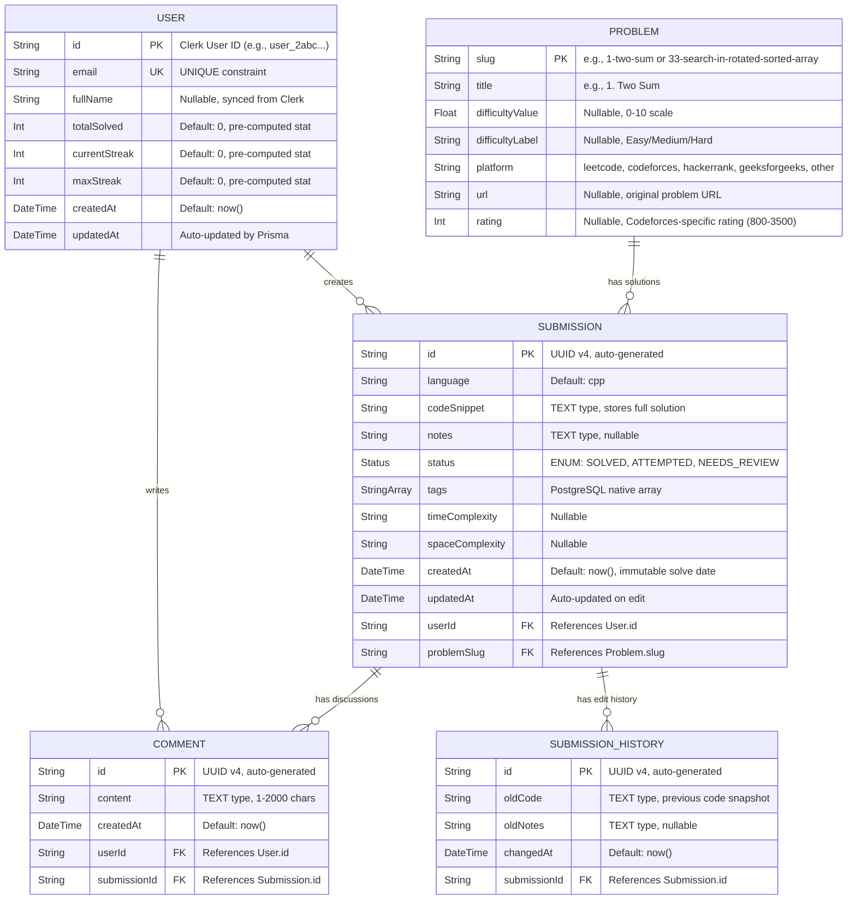

# DSApline V2.0 — Database Documentation & ER Diagram

## 1. Entity-Relationship Diagram (Mermaid)

The following Mermaid code generates the complete ER diagram for the current database schema. Copy this directly into any Mermaid renderer (GitHub, Mermaid.live, dbdiagram.io, etc.).



---

## 2. Detailed Table Descriptions

### 2.1 `User` Table

| Column | Type | Constraints | Description |
|--------|------|-------------|-------------|
| `id` | `String` | `PRIMARY KEY` | Matches Clerk authentication User ID. Not auto-generated — sourced from the external auth provider. |
| `email` | `String` | `UNIQUE`, `NOT NULL` | User's email from Clerk. Unique constraint prevents duplicate accounts. |
| `fullName` | `String` | `NULLABLE` | Full name synced from Clerk profile (First + Last). |
| `totalSolved` | `Int` | `DEFAULT 0` | **Denormalised counter**. Pre-computed for O(1) dashboard loading. Incremented atomically via `{ increment: 1 }`. |
| `currentStreak` | `Int` | `DEFAULT 0` | Pre-computed streak counter (currently computed dynamically from submission dates). |
| `maxStreak` | `Int` | `DEFAULT 0` | Historical maximum streak. |
| `createdAt` | `DateTime` | `DEFAULT now()` | Account creation timestamp. |
| `updatedAt` | `DateTime` | `@updatedAt` | Prisma auto-managed. Updates on any row modification. |

**Relationships:**
- `1:N` → `Submission` (One user has many submissions)
- `1:N` → `Comment` (One user has many comments)

**DBMS Concepts:**
- The `id` field uses an **externally-sourced primary key** (from Clerk), not a database-generated sequence. This is a deliberate design choice to avoid key collision between the auth system and the database.
- `totalSolved` is a **materialised aggregate** — a denormalisation that trades storage for read performance. Instead of `SELECT COUNT(*) FROM Submission WHERE userId = X` on every dashboard load, we store the pre-computed value and update it atomically during INSERT.

---

### 2.2 `Problem` Table

| Column | Type | Constraints | Description |
|--------|------|-------------|-------------|
| `slug` | `String` | `PRIMARY KEY` | URL-safe slug derived from the problem title. Acts as a **natural key**. |
| `title` | `String` | `NOT NULL` | Human-readable problem title (e.g., "1. Two Sum"). |
| `difficultyValue` | `Float` | `NULLABLE` | Internal 0-10 difficulty scale. Supports decimal values for Codeforces ratings mapped to the scale. |
| `difficultyLabel` | `String` | `NULLABLE` | Platform-specific label ("Easy", "Medium", "Hard"). |
| `platform` | `String` | `NOT NULL` | Source platform identifier. |
| `url` | `String` | `NULLABLE` | Original problem URL. |
| `rating` | `Int` | `NULLABLE` | Codeforces problem rating (800-3500). `NULL` for non-Codeforces problems. |

**Indexes:**
- `@@index([platform])` — B-Tree index on `platform` for fast platform-filtered queries.

**DBMS Concepts:**
- Uses a **natural primary key** (`slug`) instead of a surrogate key. This means the primary key is derived from real-world data (the problem title), enabling human-readable foreign key references in the `Submission` table.
- The dual difficulty system (`difficultyValue` + `difficultyLabel`) is a **polymorphic design** that accommodates different platforms: LeetCode uses labels ("Easy"), Codeforces uses numeric ratings (1300), and DSApline uses an internal 0-10 scale.

---

### 2.3 `Submission` Table

| Column | Type | Constraints | Description |
|--------|------|-------------|-------------|
| `id` | `String` | `PRIMARY KEY`, `DEFAULT uuid()` | UUID v4, auto-generated by PostgreSQL. |
| `language` | `String` | `DEFAULT 'cpp'` | Programming language of the solution. |
| `codeSnippet` | `String` | `NOT NULL`, `@db.Text` | Full solution code. Uses `TEXT` type (unlimited length) instead of `VARCHAR(n)`. |
| `notes` | `String` | `NULLABLE`, `@db.Text` | Learning notes and approach description. |
| `status` | `Status` | `DEFAULT SOLVED` | PostgreSQL `ENUM` type with values: `SOLVED`, `ATTEMPTED`, `NEEDS_REVIEW`. |
| `tags` | `String[]` | — | PostgreSQL native array. Stored as `text[]` in the database. |
| `timeComplexity` | `String` | `NULLABLE` | e.g., "O(N log N)". |
| `spaceComplexity` | `String` | `NULLABLE` | e.g., "O(1)". |
| `createdAt` | `DateTime` | `DEFAULT now()` | Immutable. Represents when the problem was originally solved. |
| `updatedAt` | `DateTime` | `@updatedAt` | Prisma auto-managed. Changes on every edit. |
| `userId` | `String` | `FOREIGN KEY → User.id`, `ON DELETE CASCADE` | The user who created this submission. |
| `problemSlug` | `String` | `FOREIGN KEY → Problem.slug`, `ON DELETE CASCADE` | The problem this submission solves. |

**Indexes:**
| Index | Type | Columns | Purpose |
|-------|------|---------|---------|
| `idx_submission_userId` | B-Tree | `userId` | Fast lookup: "All submissions by user X" |
| `idx_submission_problemSlug` | B-Tree | `problemSlug` | Fast lookup: "All solutions for problem Y" |
| `idx_submission_tags` | **GIN** | `tags` | Fast array containment: "Submissions tagged with 'DP'" |
| `idx_submission_createdAt` | B-Tree | `createdAt` | Fast date range: "Submissions from last 7 days" |
| `idx_submission_userId_createdAt` | B-Tree (Compound) | `userId, createdAt` | Dashboard: "User's submissions sorted by date" |
| `idx_submission_problemSlug_createdAt` | B-Tree (Compound) | `problemSlug, createdAt` | Problem page: "All solutions for a problem sorted by date" |

**DBMS Concepts:**
- **Cascading Deletes**: `onDelete: Cascade` on both foreign keys means:
  - If a `User` is deleted → all their `Submission`s are automatically deleted.
  - If a `Problem` is deleted → all `Submission`s for that problem are automatically deleted.
  - This prevents **orphan records** and maintains **referential integrity**.
- **GIN Index**: The `tags` column uses a **Generalized Inverted Index**, which creates an inverted mapping from each tag value to the rows containing it. This transforms `WHERE 'DP' = ANY(tags)` from a full table scan (O(N)) to an index lookup (O(log N)).
- **Compound Indexes**: `@@index([userId, createdAt])` creates a single B-Tree sorted by `userId` first, then `createdAt`. This is optimal for queries like `WHERE userId = X ORDER BY createdAt DESC` because PostgreSQL can satisfy both the WHERE clause and the ORDER BY clause from the index alone, avoiding a separate sort operation.
- **ENUM Type**: The `Status` field uses a PostgreSQL `ENUM`, which is stored as a 4-byte integer internally but enforces a closed set of allowed values at the database level. This is superior to a `VARCHAR` CHECK constraint because the database can perform integer comparisons instead of string comparisons.

---

### 2.4 `Comment` Table

| Column | Type | Constraints | Description |
|--------|------|-------------|-------------|
| `id` | `String` | `PRIMARY KEY`, `DEFAULT uuid()` | UUID v4. |
| `content` | `String` | `NOT NULL`, `@db.Text` | Comment text, validated to 1-2000 characters at the API layer. |
| `createdAt` | `DateTime` | `DEFAULT now()` | Comment creation timestamp. |
| `userId` | `String` | `FOREIGN KEY → User.id`, `ON DELETE CASCADE` | Author of the comment. |
| `submissionId` | `String` | `FOREIGN KEY → Submission.id`, `ON DELETE CASCADE` | The submission being discussed. |

**Indexes:**
- `@@index([submissionId])` — Fast retrieval of all comments for a specific submission.

**DBMS Concepts:**
- Dual foreign keys create a **ternary relationship**: a Comment is the association between a User and a Submission. This is conceptually similar to a **junction table** in an M:N relationship, but semantically it's a weak entity that depends on both parent entities for its existence.
- `ON DELETE CASCADE` on `submissionId` ensures that when a submission is deleted, all its discussion comments are automatically removed — maintaining **referential integrity** without application-level cleanup.

---

### 2.5 `SubmissionHistory` Table

| Column | Type | Constraints | Description |
|--------|------|-------------|-------------|
| `id` | `String` | `PRIMARY KEY`, `DEFAULT uuid()` | UUID v4. |
| `oldCode` | `String` | `NOT NULL`, `@db.Text` | Snapshot of the code **before** the edit. |
| `oldNotes` | `String` | `NULLABLE`, `@db.Text` | Snapshot of notes **before** the edit. |
| `changedAt` | `DateTime` | `DEFAULT now()` | When the edit occurred. |
| `submissionId` | `String` | `FOREIGN KEY → Submission.id`, `ON DELETE CASCADE` | The submission that was edited. |

**Indexes:**
- `@@index([submissionId])` — Fast retrieval of all historical versions.

**DBMS Concepts:**
- This table implements a **Software-Level Audit Log** (also known as a **Slowly Changing Dimension Type 4** in data warehousing terminology). Before any UPDATE operation on a Submission, the application inserts the current state into this table, creating an immutable history.
- The pattern is equivalent to a **database trigger** (`BEFORE UPDATE`) but implemented at the application layer for Prisma compatibility. The `PUT /api/submission/[id]` handler executes `prisma.submissionHistory.create()` before `prisma.submission.update()` — these two operations form a logical transaction.
- This design enables **temporal queries**: "What did user X's code look like on March 15th?" can be answered by querying `SELECT * FROM SubmissionHistory WHERE submissionId = ? AND changedAt <= '2026-03-15' ORDER BY changedAt DESC LIMIT 1`.

---

## 3. Database Normalisation Analysis

### 3.1 Current Normal Form: **3NF with Controlled Denormalisation**

| Normal Form | Status | Evidence |
|-------------|--------|----------|
| **1NF** | ✅ Satisfied | All columns are atomic (single-valued). The `tags` column stores a PostgreSQL array, which is atomic at the database level (PostgreSQL treats arrays as a single value). |
| **2NF** | ✅ Satisfied | No partial dependencies exist. Every non-key attribute depends on the entire primary key (all tables use single-column primary keys). |
| **3NF** | ✅ Satisfied (with exception) | No transitive dependencies exist. Exception: `User.totalSolved` is derivable from `COUNT(Submission WHERE userId = X)`, making it a **controlled denormalisation** for read performance. |
| **BCNF** | ✅ Satisfied | Every determinant is a candidate key. |

### 3.2 Deliberate Denormalisations

| Denormalisation | Justification |
|-----------------|---------------|
| `User.totalSolved` | Avoids expensive `COUNT(*)` aggregation on every dashboard page load. Updated atomically via `{ increment: 1 }` to maintain consistency. |
| `Submission.tags` as `String[]` | Alternative (fully normalised) design would require a `Tag` table + `SubmissionTag` junction table. The array approach eliminates two JOINs per query at the cost of making individual tag updates harder (we always overwrite the entire array). |
| `SubmissionHistory.oldCode` duplicating `Submission.codeSnippet` | Intentional data duplication for temporal queries. The history table stores snapshots because the original data is overwritten on edit. |

---

## 4. Key SQL Operations (Mapped to Prisma)

### 4.1 INSERT Operations

**Creating a new submission** (`POST /api/submit`):
```sql
-- Step 1: Upsert User (INSERT ... ON CONFLICT UPDATE)
INSERT INTO "User" (id, email, "fullName")
VALUES ($1, $2, $3)
ON CONFLICT (id) DO UPDATE SET "fullName" = $3, email = $2;

-- Step 2: Upsert Problem
INSERT INTO "Problem" (slug, title, "difficultyValue", "difficultyLabel", platform, url, rating)
VALUES ($1, $2, $3, $4, $5, $6, $7)
ON CONFLICT (slug) DO NOTHING;

-- Step 3: Insert Submission
INSERT INTO "Submission" (id, language, "codeSnippet", notes, status, tags, "userId", "problemSlug")
VALUES ($1, $2, $3, $4, 'SOLVED', $5, $6, $7);

-- Step 4: Atomic Counter Increment
UPDATE "User" SET "totalSolved" = "totalSolved" + 1 WHERE id = $1;
```

**Prisma equivalent:**
```typescript
await prisma.user.upsert({ where: { id: userId }, update: { fullName }, create: { id: userId, email, fullName } });
await prisma.problem.upsert({ where: { slug }, update: {}, create: { slug, title, platform, ... } });
await prisma.submission.create({ data: { id, language, codeSnippet, tags, userId, problemSlug } });
await prisma.user.update({ where: { id: userId }, data: { totalSolved: { increment: 1 } } });
```

### 4.2 SELECT Operations

**Dashboard analytics** (`getDashboardData()`):
```sql
-- Fetch all submissions for a user (with JOINs)
SELECT s.*, p.*, u.*
FROM "Submission" s
JOIN "Problem" p ON s."problemSlug" = p.slug
JOIN "User" u ON s."userId" = u.id
WHERE s."userId" = $1
ORDER BY s."createdAt" DESC;
```
Uses the compound index `@@index([userId, createdAt])` for optimal performance.

**Archive page** (`getGlobalArchive()`):
```sql
SELECT s.*, p.*, u.*
FROM "Submission" s
JOIN "Problem" p ON s."problemSlug" = p.slug
JOIN "User" u ON s."userId" = u.id
ORDER BY s."createdAt" DESC;
```

**Problem-centric view** (`getSubmissionsByProblem(slug)`):
```sql
SELECT s.*, u.*, 
  (SELECT COUNT(*) FROM "Comment" c WHERE c."submissionId" = s.id) AS "commentCount",
  (SELECT COUNT(*) FROM "SubmissionHistory" h WHERE h."submissionId" = s.id) AS "editCount"
FROM "Submission" s
JOIN "User" u ON s."userId" = u.id
WHERE s."problemSlug" = $1
ORDER BY s."createdAt" DESC;
```
Uses the compound index `@@index([problemSlug, createdAt])`.

**Leaderboard** (`getLeaderboard()`):
```sql
SELECT s."userId", u."fullName", s."createdAt"
FROM "Submission" s
JOIN "User" u ON s."userId" = u.id;
-- Application-level: GROUP BY userId, COUNT per user, calculate streaks
```

### 4.3 UPDATE Operations

**Editing a submission** (`PUT /api/submission/[id]`):
```sql
-- Step 1: Read existing (for history snapshot)
SELECT * FROM "Submission" WHERE id = $1;

-- Step 2: Insert into history (audit log)
INSERT INTO "SubmissionHistory" ("submissionId", "oldCode", "oldNotes")
VALUES ($1, $2, $3);

-- Step 3: Update the submission
UPDATE "Submission" 
SET "codeSnippet" = $2, notes = $3, tags = $4, language = $5, "updatedAt" = NOW()
WHERE id = $1;

-- Step 4: Update difficulty (optional)
UPDATE "Problem" SET "difficultyValue" = $2 WHERE slug = $1;
```

**Editing a comment** (`PUT /api/comments`):
```sql
UPDATE "Comment" SET content = $2 WHERE id = $1 AND "userId" = $3;
```
The `AND "userId" = $3` is the ownership guard implemented at the application level.

### 4.4 UPSERT Operations

**User sync from Clerk** (runs on every authenticated API call):
```sql
INSERT INTO "User" (id, email, "fullName")
VALUES ($1, $2, $3)
ON CONFLICT (id) DO UPDATE 
SET "fullName" = EXCLUDED."fullName", email = EXCLUDED.email;
```
This is the SQL equivalent of Prisma's `prisma.user.upsert()`. The `ON CONFLICT` clause converts to an `UPDATE` when the row already exists, implementing an **idempotent** user sync — it can be called multiple times without creating duplicate records.

### 4.5 Aggregation Queries

**Activity Map (GROUP BY)**:
```sql
-- Conceptual SQL for the activity heatmap
SELECT DATE(s."createdAt") AS solve_date, COUNT(*) AS problem_count
FROM "Submission" s
WHERE s."userId" = $1
GROUP BY DATE(s."createdAt")
ORDER BY solve_date ASC;
```
Currently implemented in application code (JavaScript `forEach` loop) but represents a `GROUP BY` aggregation with `COUNT(*)`.

**Streak Calculation (Window Function equivalent)**:
```sql
-- Conceptual SQL using window functions
WITH ranked_dates AS (
  SELECT DISTINCT DATE(s."createdAt") AS solve_date,
    ROW_NUMBER() OVER (ORDER BY DATE(s."createdAt")) AS rn
  FROM "Submission" s WHERE s."userId" = $1
),
streak_groups AS (
  SELECT solve_date,
    solve_date - (rn * INTERVAL '1 day') AS group_key
  FROM ranked_dates
)
SELECT group_key, COUNT(*) AS streak_length
FROM streak_groups
GROUP BY group_key
ORDER BY streak_length DESC
LIMIT 1;
```
This is the SQL Window Function approach to streak calculation. The application currently implements this logic in TypeScript for flexibility.

---

## 5. Referential Integrity & Constraints Summary

| Constraint | Table | Type | Purpose |
|------------|-------|------|---------|
| `User.id` | User | `PRIMARY KEY` | Entity integrity |
| `User.email` | User | `UNIQUE` | Prevents duplicate accounts |
| `Problem.slug` | Problem | `PRIMARY KEY` (Natural Key) | Entity integrity |
| `Submission.id` | Submission | `PRIMARY KEY` (UUID) | Entity integrity |
| `Submission.userId → User.id` | Submission | `FOREIGN KEY` + `CASCADE DELETE` | Referential integrity |
| `Submission.problemSlug → Problem.slug` | Submission | `FOREIGN KEY` + `CASCADE DELETE` | Referential integrity |
| `Comment.userId → User.id` | Comment | `FOREIGN KEY` + `CASCADE DELETE` | Referential integrity |
| `Comment.submissionId → Submission.id` | Comment | `FOREIGN KEY` + `CASCADE DELETE` | Referential integrity |
| `SubmissionHistory.submissionId → Submission.id` | SubmissionHistory | `FOREIGN KEY` + `CASCADE DELETE` | Referential integrity |
| `Submission.status` | Submission | `ENUM` (CHECK equivalent) | Domain integrity |
| `User.totalSolved` | User | `DEFAULT 0` | Domain integrity |

---

## 6. ACID Properties in DSApline

| Property | How It's Implemented |
|----------|---------------------|
| **Atomicity** | Each API endpoint performs its database operations as a logical unit. For example, the submission flow (User Upsert → Problem Upsert → Submission Insert → Stats Update) either all succeed or the error handler catches the failure. Prisma wraps individual operations in implicit transactions. |
| **Consistency** | Foreign key constraints (`ON DELETE CASCADE`) ensure no orphan records exist. The `UNIQUE` constraint on `User.email` prevents duplicate accounts. ENUM types restrict `status` to predefined values. |
| **Isolation** | PostgreSQL's default isolation level is `READ COMMITTED`, meaning each query sees only data committed before the query began. This prevents dirty reads during concurrent submissions. |
| **Durability** | Neon.tech PostgreSQL uses WAL (Write-Ahead Logging). Once a transaction is committed, it survives process crashes and server reboots. Neon additionally replicates data across availability zones. |
